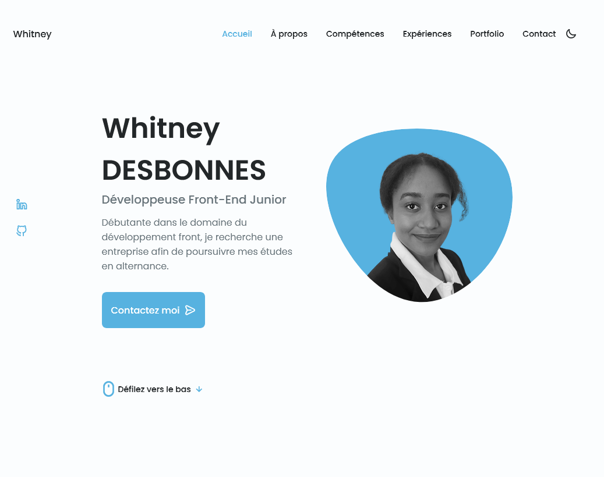

## Table des matières / Table of contents

- [Aperçu](#Aperçu)
  - [Le ​​défi](#le-défi)
  - [Capture d'écran](#capture-d'écran)
  - [Liens](#liens)
- [Mon processus](#mon-processus)
  - [Construit avec](#construit-avec)
  - [Ce que j'ai appris](#ce-que-j'ai-appris)
  - [Développement continu](#continued-development)
  - [Ressources utiles](#ressources-utiles)
- [Auteur](#auteur)
- [Remerciements](#Remerciements)
- [Youtube](#Youtube)


## Aperçu / Overview


### Le défi / The challenge

- Site Web de portfolio réactif utilisant Html, Css et JavaScript, avec une belle interface utilisateur.


### Capture d'écran / Screenshot




### Liens / Links


## Mon processus / My process


### Construit avec / Built with

- Balisage sémantique HTML5
- Propriétés personnalisées CSS
- Flexbox
- Grid
- Javascript


### Ce que j'ai appris / What I learned

```html


```
```css


```


### Poursuite du développement / Continued development

Essayer de le refaire sans l'aide du tutoriel.


### Ressources utiles / Useful resources


## Auteur / Author

- Chaîne Youtube - [Bedimcode](https://www.youtube.com/c/Bedimcode)


## Remerciements / Acknowledgments

## Youtube
- Lien vidéo du tutoriel - [Youtube](https://youtu.be/27JtRAI3QO8)
